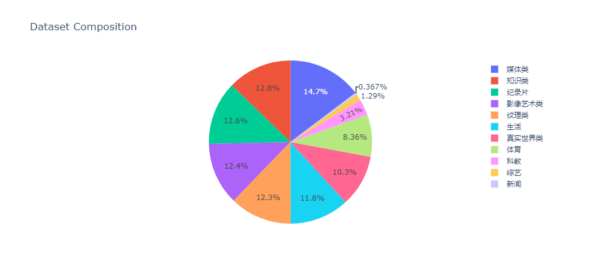

# Intern · Wanjuan Multimodal Corpus


## Intern · WanJuan 1.0

Intern · WanJuan 1.0 is the first open-source version of Intern · Wanjuan multimodal corpus, which includes three parts: text dataset, image-text dataset, and video dataset, with a total data volume exceeding 2TB. Based on the corpus built by the large model data alliance, the Shanghai AI Lab has carried out fine-grained cleaning, deduplication, and value alignment on some of the data, forming Intern · WanJuan 1.0, which has four characteristics those are multiple integration, fine processing, value alignment, ease of use and efficiency, etc. .

- In terms of multiple integration, Intern · WanJuan 1.0 contains multi-modal data such as text, image and video, covering multiple fields such as science and technology, literature, media, education and law. It improves the knowledge content, logical reasoning and Significant effect on generalization ability.

- In terms of fine processing, Intern · WanJuan 1.0 has gone through refined data processing links such as language screening, text extraction, format standardization, data filtering and cleaning based on rules and models, multi-scale deduplication, and data quality assessment, so it can be more accurate It is well adapted to the subsequent model training requirements.

- In terms of value alignment, during the construction of Intern · WanJuan 1.0, the researchers focused on the alignment of the content with the mainstream Chinese values, and improved the purity of the corpus through the combination of algorithms and manual evaluation.

- In terms of ease of use and efficiency, the researchers adopted a unified format in Intern · WanJuan 1.0, and provided detailed field descriptions and tool guidance, making it easy to use and efficient. Let it can be quickly applied to Multimodal Large Language Models (MLLMs) or large language model (LLM) training.

Currently, Intern · WanJuan 1.0 has been applied to the training of those large models such as Intern Multimodal and Intern Puyu. Through the "digestion" of high-quality corpus, the Intern series models have shown excellent performance in various generative tasks such as semantic understanding, knowledge question answering, visual understanding, and visual question answering.

## Intern · WanJuan 1.0 - text dataset

- Introduction

Intern · WanJuan 1.0 Text Dataset is composed of cleaned pre-training corpora from different sources such as web pages, encyclopedias, books, patents, textbooks, and exam questions. The total amount of data exceeds 500 million documents, and the data size exceeds 1TB. The corpus processes data in various formats such as html, text, pdf and epub into a jsonl format with unified fields。And after fine-grained cleaning, deduplication, and value alignment, it forms a safe, reliable, and high-quality pre- training corpus.

- Composition


- Sample

```json
{
    "id": "BkORdv3xK7IA0HG7pccr",
    "content": "\\*诗作[222]\n录自索菲娅·马克思的笔记本\n#### 人生\n时光倏忽即逝，\n宛如滔滔流水；\n时光带走的一切，\n永远都不会返回。\n生就是死，\n生就是不断死亡的过程；\n人们奋斗不息，\n却难以摆脱困顿；\n人走完生命的路，\n最后化为乌有；\n他的事业和追求\n湮没于时光的潮流。\n对于人的事业，\n精灵们投以嘲讽的目光；\n因为人的渴望是那样强烈，\n而人生道路是那样狭窄迷茫；\n人在沾沾自喜之后，\n便感到无穷的懊丧；\n那绵绵不尽的悔恨\n深藏在自己的心房；\n人贪婪追求的目标\n其实十分渺小；\n人生内容局限于此，\n那便是空虚的游戏。\n有人自命不凡，\n其实并不伟大；\n这种人的命运，\n就是自我丑化。\n卡尔·马克思\n#### 查理大帝\n使一个高贵心灵深受感动的一切，\n使所有美好心灵欢欣鼓舞的一切，\n如今已蒙上漆黑的阴影，\n野蛮人的手亵渎了圣洁光明。\n巍巍格拉亚山的崇高诗人，\n曾满怀激情把那一切歌颂，\n激越的歌声使那一切永不磨灭，\n诗人自己也沉浸在幸福欢乐之中。\n高贵的狄摩西尼热情奔放，\n曾把那一切滔滔宣讲，\n面对人山人海的广场，\n演讲者大胆嘲讽高傲的菲力浦国王。\n那一切就是崇高和美，\n那一切笼罩着缪斯的神圣光辉，\n那一切使缪斯的子孙激动陶醉，\n如今却被野蛮人无情地摧毁。\n这时查理大帝挥动崇高魔杖，\n呼唤缪斯重见天光；\n他使美离开了幽深的墓穴，\n他让一切艺术重放光芒。\n他改变陈规陋习，\n他发挥教育的神奇力量；\n民众得以安居乐业，\n因为可靠的法律成了安全的保障。\n他进行过多次战争，\n杀得尸横遍野血染疆场；\n他雄才大略英勇顽强，\n但辉煌的胜利中也隐含祸殃；\n他为善良的人类赢得美丽花冠，\n这花冠比一切战功都更有分量；\n他战胜了那个时代的蒙昧，\n这就是他获得的崇高奖赏。\n在无穷无尽的世界历史上，\n他将永远不会被人遗忘，\n历史将为他编织一顶桂冠，\n这桂冠决不会淹没于时代的激浪。\n卡尔·马克思于1833年\n#### 莱茵河女神\n**叙事诗**\n(见本卷第885—889页)\n#### 盲女\n**叙事诗**\n(见本卷第852—858页)\n#### 两重天\n**乘马车赴柏林途中**\n(见本卷第475—478页)\n#### 父亲诞辰献诗。1836年\n**(见本卷第845—846页)**\n#### 席勒\n**十四行诗两首**\n(见本卷第846—847页)\n#### 歌德\n**十四行诗两首**\n(见本卷第848—849页)\n#### 女儿\n**叙事诗**\n(见本卷第838—841页)\n#### 凄惨的女郎\n**叙事诗**\n(见本卷第533—537页)\n卡·马克思写于1833年一大约1837年\n第一次用原文发表于《马克思恩格斯全集》1975年历史考证版第1部分第1卷\n并用俄文发表于《马克思恩格斯全集》1975年莫斯科版第40卷\n原文是德文\n中文根据《马克思恩格斯全集》1975年历史考证版第1部分第1卷翻译\n---\n**注释：**\n[222]马克思的这些诗作是他的姐姐索菲娅抄录在一个笔记本里的。除了马克思的诗作外，笔记本里还有其他人的诗作以及索菲娅自己和她的亲友的个人记事。马克思的这些诗作，除了《人生》和《查理大帝》外都在马克思的几本诗集和索菲娅的纪念册里出现过。《查理大帝》一诗注明写作日期是1833年，可见马克思早在中学时代就已开始写诗了。《盲女》注明写作日期是1835年。为祝贺父亲生日而献给亨利希·马克思的诗作的写作日期应该不晚于1836年初。——913。"
}
```

- Field

  - id: [string type] the unique ID of the document.
  - content: [string type] the content of the document, the format is normal Text format or Markdown format.


## Intern · WanJuan 1.0 - image-text dataset

- Introduction

The data of Intern · WanJuan 1.0 - image-text dataset mainly come from public webpages, which are processed to form interlaced images and text documents. The total number of documents exceeds 22 million, and the data size exceeds 140GB (excluding pictures), covering news events, people, natural landscapes, social life and other fields. The data is in a unified jsonl format, where the pictures are given in the form of url. If you need to get the picture data, you can use the following script: 
https://github.com/opendatalab/image-downloader

- Sample

```json
{
    "id": "BkKuk1zxK3YAbgNSWYik",
    "img_list": [
        {
            "url": "http://digitalpaper.stdaily.com/http_www.kjrb.com/kjrb/images/2021-01/21/02/1007771_wangjj_1611154300505_b.jpg",
            "sha256": "019cca88f37ae5ffe59ad48ad5c392fe64e489f08e841b6ea50c79c18f5c6ec3",
            "caption": "",
            "width": "400",
            "height": "266"
        }
    ],
    "content": "\n奋斗百年路 启航新征程\n走进觉悟社当年社员开会的房间，桌子中间摆放的一盘纸条格外引人注目，周恩来“伍豪”和邓颖超“逸豪”的笔名就诞生于此。\n“为了斗争的需要，觉悟社社员们采取抓阄的办法，以号取名。”1月19日，天津觉悟社纪念馆助理馆员迟爱民讲述了102年前的情景：当时年纪最小的邓颖超抓到了最小数字1号，所以叫“逸豪”。周恩来抓到5号，就取名“伍豪”。\n时间回到1919年那个思潮澎湃的年代。在天津，以周恩来为代表的一批以天下为己任的先进分子，在众多新思潮中艰难地探索革命真理。通过觉悟社的锻炼和洗礼，其主要成员成长为我国早期的共产主义者。周恩来也在这个时期成为马克思主义的宣传者。\n诞生：冲破封建束缚探索革命真理\n觉悟社成立于“五四运动”在天津发展到最高潮的阶段。\n觉悟社纪念馆中的一张合影，记录下了这一张张充满青春朝气的脸庞。他们神色凝重，目光坚定，这些人就是觉悟社成立之初的部分社员。\n“这个比一般学生爱国团体更加严密的组织的成立，源于之前一次赴京请愿斗争。”迟爱民介绍，1919年9月2日，周恩来等天津各界联合会、学生联合会、女界爱国同志会的先进青年在返津途中，经过交流，一致认为，应该成立一个研究新思潮，探索革命真理，冲破封建习俗束缚，由男女同学共同组建的团体。\n1919年9月16日，在天津东南角草场庵天津学生联合会办公室里，革命青年团体觉悟社诞生了。出席成立会的男女各10名成员成为最初的社员，包括周恩来、邓颖超、马骏、刘清扬、郭隆真等。\n周恩来执笔起草了《觉悟的宣言》。觉悟社成立后，以“革心”和“革新”的精神组织演讲，出版刊物《觉悟》，探讨研究新思潮，很快就成为天津学生爱国运动的中坚力量。\n引领：觉悟社成立5天后李大钊应邀前来\n在波澜起伏的斗争中，周恩来和觉悟社社员们迫切感到，要用先进思想武装头脑。\n觉悟社社员谌小岑曾回忆道，在觉悟社成立后第5天，我国最早的马克思主义者、中国共产党先驱李大钊就应邀到觉悟社座谈。李大钊听完邓颖超对觉悟社的介绍后，对觉悟社深表赞许，他表示“觉悟社是男女平等、社交公开的先行”。\n在李大钊的启发下，觉悟社成员阅读了李大钊发表在《新青年》上的《庶民的胜利》《布尔什维主义的胜利》《我的马克思主义观》等文章。还邀请徐谦、包世杰、钱玄同、刘半农等来演讲，并召开讨论会。\n天津市委党校文史教研部副主任徐娜表示，觉悟社社员们学习、讨论中国最早的马列主义文献，并积极投身实践斗争，为他们选择信仰马克思主义、走上共产主义道路进行了最初的启蒙与引导。\n影响：觉悟社多人加入中国共产党\n1920年1月29日，在抵制日货的斗争中，周恩来、马骏等人被捕，成立仅4个月的觉悟社受到沉重打击。纪念馆展厅中的两本书《警厅拘留记》和《检厅日录》，记录了青年们斗争的艰难和残酷。身陷囹圄的周恩来先后用6个晚上，向狱友介绍马克思主义学说。出狱后，编写了3.5万字的《警厅拘留记》和《检厅日录》。在后来旅法期间，周恩来说“我的思想是颤动于狱中”，可以说这是周恩来马克思主义世界观形成的重要时期。\n1920年11月，随着周恩来、刘清扬、郭隆真等人赴法国勤工俭学，觉悟社的社员们开始星散，觉悟社的集体活动停止……\n觉悟社存在的时间虽然不长，但为一批年轻人树立马克思主义信仰奠定了坚实基础。徐娜表示，觉悟社作为“五四”运动爆发之后在天津影响最广泛、作用最突出的进步学生组织，其表现出的反对封建主义、憎恨一切剥削和压迫的进步思想，为接受马克思主义作好了准备。随后，远赴欧洲勤工俭学的周恩来加入中国共产党八个发起组之一的巴黎共产主义小组，成为中国共产党创建人之一，而其他的觉悟社主要社员如马骏、邓颖超、郭隆真等都加入了中国共产党，成为革命的骨干力量。"
}
```

- Field

  - id: [string type] the unique ID of the document.
  - img_list: [array type], the list of images contained in the document. The information of each picture includes network url, sha256 of url, length and width.
  - content: [string type] the content of the document, the format is normal Text format or Markdown format.


### Intern · WanJuan 1.0 - video dataset

- Introduction

Intern · WanJuan 1.0 Video Dataset is mainly from China Central Radio & Television and Shanghai Media Group. It contains various types of program videos, with more than 1,000 video files and a data size of more than 900GB. The content covers military, literature and art, sports, nature, real society, knowledge, video art, media, food, historical documentaries, science and education, etc.

- Composition



## download link

To download the complete dataset, please go to: 
https://opendatalab.org.cn/WanJuan1.0


## License

The whole Intern · WanJuan 1.0 adopts the CC BY 4.0 license agreement. You are free to share and adapt this dataset, subject to the following conditions:

- Attribution: You must give appropriate attribution to the author, provide a link to the agreement, and indicate whether modifications were made (to the original data set). You may do so in any reasonable way, but not in any way that implies that the licensor agrees with you or your use.

- No Additional Restrictions: You may not use legal terms or technological measures to restrict others from doing anything the license permits.

For the complete content of the agreement, please visit [CC BY 4.0 Agreement Full Text](https://creativecommons.org/licenses/by/4.0/).


### Special attention items

Note that some subsets of this dataset may be subject to other agreements. Before using a specific subset, please be sure to read the relevant agreement carefully to ensure compliant use. For more detailed protocol information, please check the relevant documents or metadata of a specific subset.

As a non-profit organization, OpenDataLab advocates a harmonious and friendly open source communication environment. If you find any content that infringes your legal rights in the open source dataset, you can send an email to (OpenDataLab@pjlab.org.cn), and please indicate the relevant infringement in the email. A detailed description of the facts and provide us with relevant ownership certification materials. We will initiate the investigation and processing mechanism within 3 working days, and take necessary measures to deal with it (as listed below). But you should ensure the authenticity of your complaint, otherwise you should be solely responsible for the adverse consequences after taking measures.


## Citation

```
@misc{conghui2022opendatalab,
  title={OpenDataLab: Empowering General Artificial Intelligence with Open Datasets},
  author={Conghui He, Wei Li, Zhenjiang Jin, Bin Wang, Chao Xu, Dahua Lin},
  howpublished = {\url{https://opendatalab.com/}}
  year={2022}
}
```